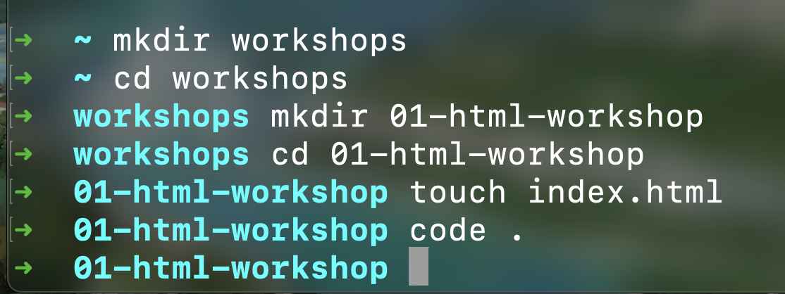
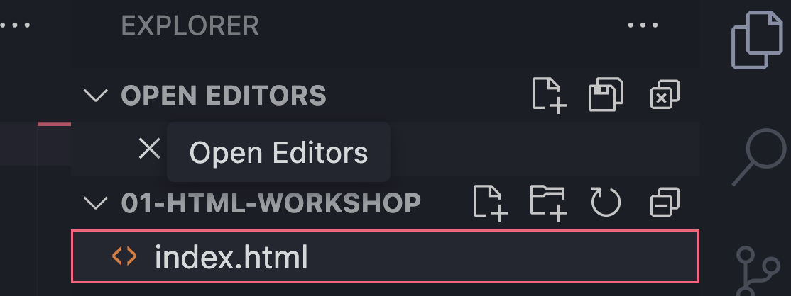
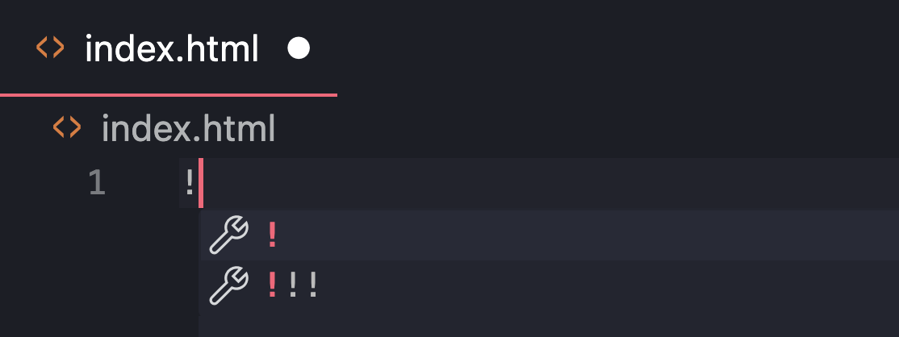
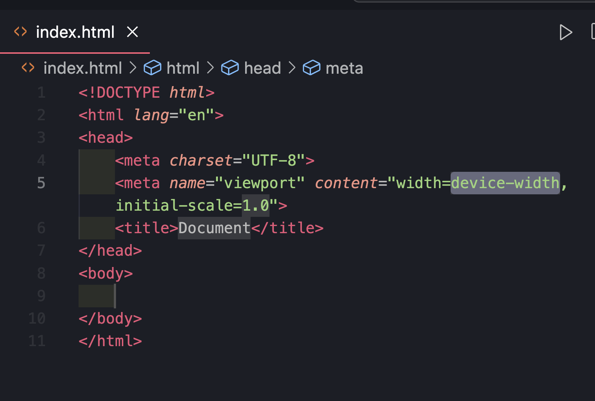

1) You might want to have something like this (of course, no need to create a new workshop folder eachtime)

2) Hitting code . should open up vscode for you. Once inside vscode, click on your  index.html file
 

3) Hitting ! will give you a shortcut to give you boilerplate so you don't have to do the basic setup yourself eachtime

4)The boilerplate will look something like this - 

get started editing it by adding some tags to the `<body>` section!

Happy hacking!